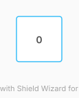

# ZMK Configuration for charybdis_mini

*Generated by Shield Wizard for ZMK*



Download compiled firmware from the Actions tab. <https://zmk.dev/docs/user-setup#installing-the-firmware>

Edit your keymap <https://zmk.dev/docs/keymaps>.
User keymap is located at [`config/charybdis_mini.keymap`](config/charybdis_mini.keymap).

-----

<details>
<summary>
Shield Wizard Debug Information
</summary>

In case of broken configuration, here is the Shield Wizard internal data used to generate this configuration:

Commit: ab99418c376887d043556e4a1af5a8d1c78d686c

```json
{"name":"charybdis_mini","shield":"charybdis_mini","dongle":false,"modules":["badjeff/pmw3610"],"layout":[{"id":"01M1CM319WEVF7VBKBRA0ZKDNR","part":1,"row":0,"col":0,"w":1,"h":1,"x":0,"y":0,"r":0,"rx":0,"ry":0}],"parts":[{"name":"left","controller":"nice_nano_v2","pins":{},"kscans":[],"keys":{},"encoders":[],"buses":{}},{"name":"right","controller":"nice_nano_v2","pins":{"d5":{"usage":"bus","bus":"spi0","role":"sck"},"d6":{"usage":"bus","bus":"spi0","role":"miosio"},"d4":{"usage":"device","deviceId":"01M1CKQBY9YSQCP4NBTRA5AJQT","role":"cs"},"d3":{"usage":"device","deviceId":"01M1CKQBY9YSQCP4NBTRA5AJQT","role":"irq"},"d7":{"usage":"kscan","kscan":"01M1CM3QSP4WEP03CCPRYPNQF3","role":"input"},"d8":{"usage":"kscan","kscan":"01M1CM3QSP4WEP03CCPRYPNQF3","role":"output"}},"kscans":[{"kind":"matrix","id":"01M1CM3QSP4WEP03CCPRYPNQF3","diodes":true}],"keys":{"01M1CM319WEVF7VBKBRA0ZKDNR":{"input":"d7","output":"d8"}},"encoders":[],"buses":{"spi0":{"type":"spi","devices":[{"id":"01M1CKQBY9YSQCP4NBTRA5AJQT","type":"pmw3610","cpi":600,"swapxy":false,"invertx":false,"inverty":false}]}}}]}
```

</details>
# test
